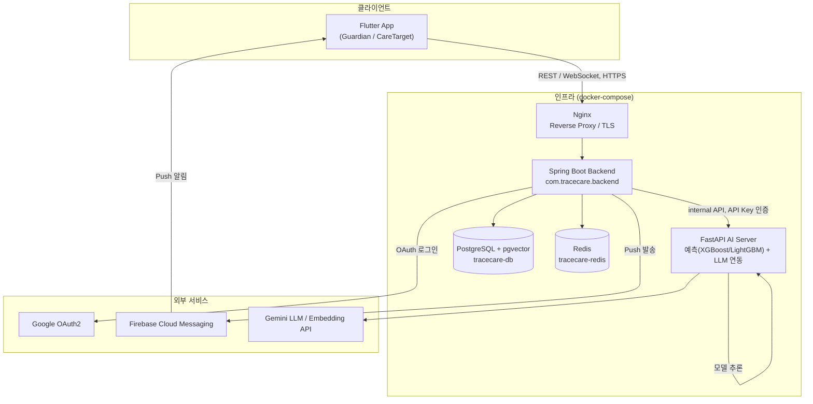
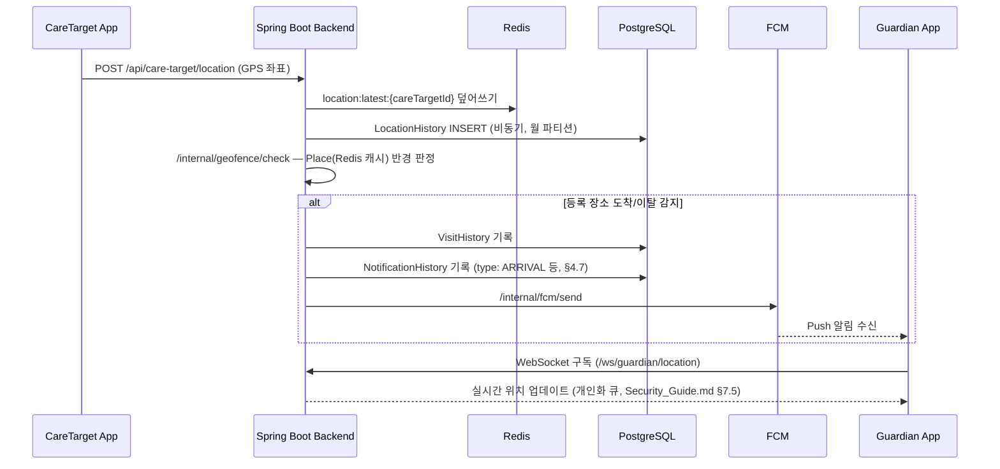
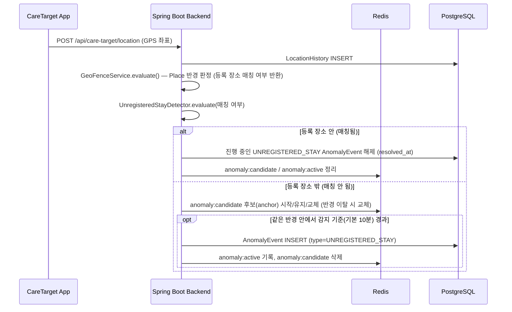
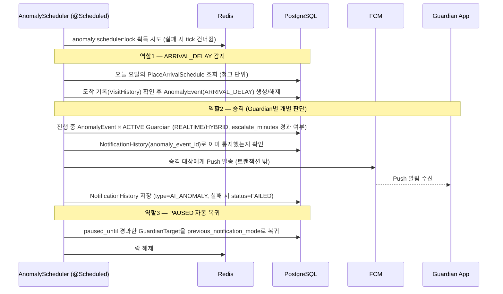
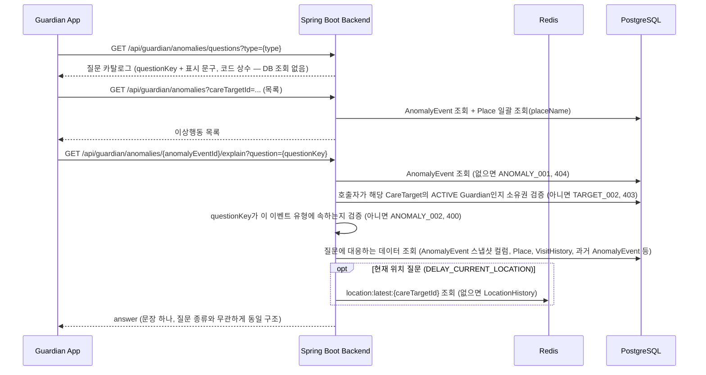
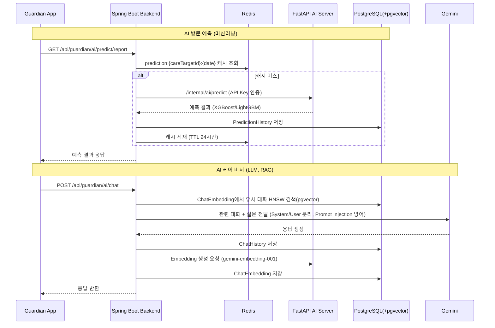
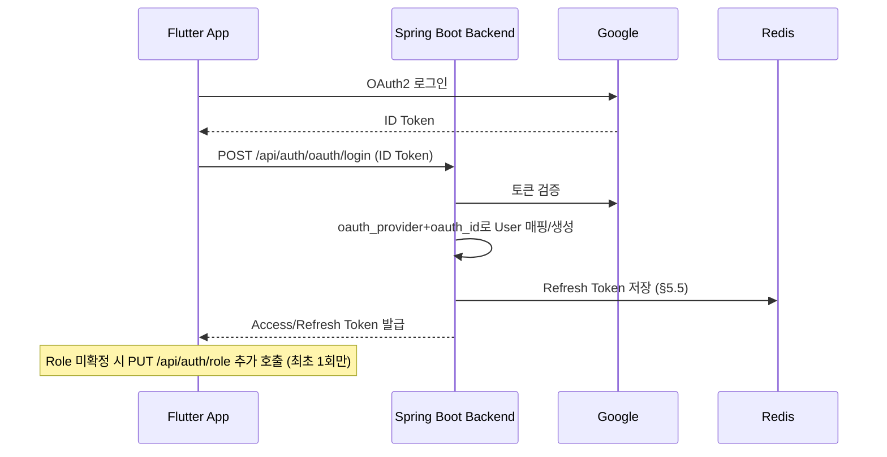

# System Overview
>해당파일 경로 docs/architecture/System_Overview.md

프로젝트: TraceCare — 아이·노인 케어 위치추적 알림 시스템
문서 위치: `docs/architecture/System_Overview.md`
버전: v1.0

> 이 문서는 **전체 시스템이 어떻게 맞물려 돌아가는지 한눈에 보여주는 것**만 담당한다.
> 각 컴포넌트의 상세 설계(왜 이렇게 만들었는지, 구체적인 API/스키마/정책)는 이 문서에서 다시 설명하지 않고 아래 원본 문서로 연결한다. 이 문서만 보고 "전체 그림"을 파악한 다음, 필요한 부분만 해당 문서로 들어가면 된다.

---

## 목차

1. 전체 시스템 구성도
2. 컴포넌트별 역할 요약
3. 핵심 데이터 흐름 — 위치 추적 → 알림
4. 핵심 데이터 흐름 — AI 예측/케어 비서
5. 인증 흐름 요약
6. 로컬 개발 환경 vs 배포 구조

---

## 1. 전체 시스템 구성도

- 지금은 1인 개발·EC2 1대 포트폴리오 규모라 모든 컴포넌트가 `docker-compose.yml` 하나로 기동된다(현재는 `db`, `redis`만 정의됨 — `backend`/`ai-server` 컨테이너화는 추후 추가 예정).
- 설계 자체는 대규모 운영(수십만~수백만 사용자)을 전제로 되어 있다(`DATABASE_DESIGN_GUIDE.md` §1.1, 루트 `CLAUDE.md` IMPORTANT 항목) — 지금 인프라가 단순하다고 설계까지 단순화하지 않는다.

## 2. 컴포넌트별 역할 요약

| 컴포넌트 | 역할 | 상세 문서 |
|---|---|---|
| Flutter App | Guardian/CareTarget 공용 앱, Role에 따라 화면 분기 | `docs/frontend/Coding_Convention.md` |
| Spring Boot Backend | REST/WebSocket API, 인증/인가, 비즈니스 로직, 외부 서비스 오케스트레이션 | `docs/backend/Coding_Convention.md`, `docs/api/API_Specification.md` |
| FastAPI AI Server | 방문 예측(ML), AI Care Chat(LLM) — Backend만 호출하는 내부 전용 서버 | `docs/ai-server/Coding_Convention.md` |
| PostgreSQL (+pgvector) | 영구 저장. Master/Time-Series/Derived 3그룹으로 분류해 설계 | `docs/db/DATABASE_DESIGN_GUIDE.md` |
| Redis | Cache Aside(위치/장소/예측 등), Refresh Token, JWT Blacklist | `docs/backend/Cache_Strategy_Guide.md`, `docs/security/Security_Guide.md` §5 |
| Nginx | TLS Termination, Reverse Proxy | `docs/security/Security_Guide.md` §4.4(HTTPS) |
| Google OAuth2 | 소셜 로그인 전용(자체 비밀번호 미보관) | `docs/security/Security_Guide.md` §6 |
| FCM | Push 알림 발송 | `docs/backend/Cache_Strategy_Guide.md`(FCM Token 캐시), `docs/api/API_Response_Rule.md` §8.6 |
| Gemini API | LLM 응답 생성 + Embedding(RAG용 벡터 검색) | `docs/db/DATABASE_DESIGN_GUIDE.md` §11.3 |

## 3. 핵심 데이터 흐름 — 위치 추적 → 알림

루트 `CLAUDE.md`가 정의한 이 프로젝트의 핵심 흐름이다: **위치 수신 → 도착/이탈 판단(GeoFence) → 이상 이동 감지 → 알림(FCM) → AI 분석/비서**.

- GeoFence 판정에 쓰는 Place 데이터는 매번 DB를 안 보고 Redis 캐시(`place:list:{guardianId}`, 5~10분 TTL)를 우선 사용한다(`Cache_Strategy_Guide.md` §3.2).
- FCM 발송 실패는 일반 알림과 긴급 알림(`EMERGENCY`)을 다르게 처리한다 — 긴급 알림은 실패해도 반드시 이력이 남고 fail-safe로 처리된다(`Exception_Handling_Rule.md` §9.2, `docs/api/API_Response_Rule.md` §5.2 EMERGENCY 도메인).
- WebSocket 인가(연결/구독)는 REST와 동일한 3단계 인가 구조를 따른다(`Security_Guide.md` §7.5).

### 3.1 이상행동 감지 — 위치 수신 → GeoFence → 미등록 체류 감지 (`UNREGISTERED_STAY`)

위 위치 수신 흐름의 GeoFence 판정 결과(등록 장소 매칭 여부)를 이어받아, 등록되지 않은 곳에서 감지 기준(기본 10분) 이상 머무는지를 판단한다. 상세 설계: `DATABASE_DESIGN_GUIDE.md` §15.2, 캐시: `Cache_Strategy_Guide.md` §3.2(`anomaly:candidate`, `anomaly:active`).

- 감지 전 "머무는 중" 후보는 Redis에만 존재하고(유실 시 카운트만 리셋되는 fail-open 허용 예외), 감지 결과인 `AnomalyEvent`의 Source of Truth는 PostgreSQL이다.
- 이 흐름은 "감지"까지만 담당한다. 알림 승격은 아래 스케줄러 tick이 담당한다.

### 3.2 이상행동 감지·승격 — 스케줄러 tick (`AnomalyScheduler`)

하나의 스케줄러(기본 5분 주기, `anomaly.scheduler.fixed-delay-minutes`)가 3가지 책임을 공유한다. 수평 확장 시 중복 실행을 막는 Redis 분산 락(`anomaly:scheduler:lock`)으로 tick 전체를 감싼다. 상세: `DATABASE_DESIGN_GUIDE.md` §15.1~§15.3, §15.6.

- `escalate_minutes_*`가 NULL이거나 모드가 `REPORT_ONLY`/`PAUSED`인 Guardian은 즉시 알림으로 승격되지 않는다(`DATABASE_DESIGN_GUIDE.md` §15.3).

### 3.3 이상행동 설명 — `/explain` 고정 질문 템플릿 조회 (LLM 미사용)

Guardian이 이상행동 목록에서 항목을 선택하면, 그 유형의 질문 카탈로그(서버가 제공) 중 하나를 골라 저장된 데이터로 조립된 답변을 받는다. **LLM/Gemini를 호출하지 않는다.** 질문 목록과 답변 데이터 출처: `DATABASE_DESIGN_GUIDE.md` §15.7, API: `API_Specification.md` §3.9.

## 4. 핵심 데이터 흐름 — AI 예측/케어 비서

- AI 서버 응답 없음/LLM 호출 실패는 500으로 통일해서 처리한다(`Exception_Handling_Rule.md` §9.3, `AI_001`/`AI_002`).
- Prompt Injection 방어(시스템 프롬프트/사용자 입력 분리)는 `Security_Guide.md` §9 A05:2025(Injection) 대응 항목을 따른다.

## 5. 인증 흐름 요약

- Access Token 만료 시 Flutter는 `AUTH_002` 코드를 받아 자동으로 `/api/auth/refresh`를 호출한다.
- 상세 흐름·Token Rotation·Blacklist 정책은 `docs/security/Security_Guide.md` §1~§5가 원본이다.

## 6. 로컬 개발 환경 vs 배포 구조

| 구분 | 로컬 개발 | 배포(목표) |
|---|---|---|
| 인프라 | `docker compose up -d` (db, redis) + 각 앱 로컬 실행 | EC2 1대, Docker Compose (포트폴리오 단계) |
| DB 접속 | `localhost:5433` | 컨테이너 내부 네트워크 |
| Redis | `localhost:6379`, 인증 없음 | `requirepass` 적용 필요(`docker-compose.yml` 주석 참고) |
| TLS | 없음(HTTP) | Nginx에서 TLS Termination 필수 |
| CI/CD | 수동 실행 | Jenkins + GitHub Webhook (`OWASP_Security_Guide.md` §3.3, §8) |

배포 아키텍처의 상세(Nginx 설정, Jenkins 파이프라인 구조, 스케일 아웃 전략)는 아직 별도 문서가 없다 — 필요해지면 `docs/architecture/Deployment_Architecture.md`로 분리한다(지금은 범위 밖).
